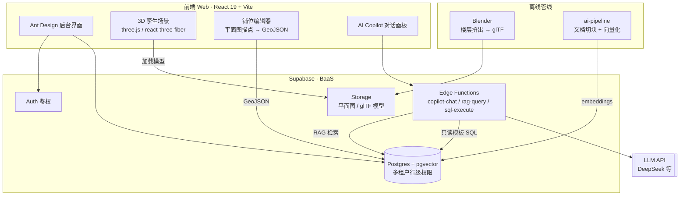

# Mall AI Digital Twin · 商场 AI 数字孪生管理平台


> 把购物中心搬进浏览器：3D 楼层孪生 + 铺位/租户/租约管理 + 数据看板 + 可对话的 AI Copilot。
> 一套多租户底座，换平面图和铺位表就能复用到不同商场。
>
> A browser-based **digital-twin + AI management platform** for shopping malls: 3D floor visualization, unit/tenant/lease management, analytics, and a conversational AI copilot. Multi-tenant by design — swap floor plans + unit tables to onboard a new mall.

---

## 为什么做这个 / Why

线下商业地产的"经营管理可视化"通常要么贵（BIM/实景扫描），要么各管各的表格。这套平台走的是**零预算可落地**路线：管理员在平面图上画出铺位多边形 → 挤出成 3D 楼层 → 绑定租户与合同数据 → 在 3D 场景里点击查询，并用自然语言问"哪些铺位快到期了"。

## 架构 / Architecture



## 功能 / Features

- 商场 / 楼层 / 铺位三级管理（Mall · Floor · Unit）
- 浏览器内 3D 孪生：楼层切换、相机飞行、铺位高亮、点击射线选中
- 铺位编辑器：导入底图 → 描点画 polygon → 导出 GeoJSON
- 物业管理：租户、租约、单元状态（空铺/在租/即将到期）
- 数据看板与业态分析
- AI Copilot：基于该商场文档与数据的 RAG 问答 + 预编译只读 SQL 模板（防注入）
- 多租户隔离：`tenant_id` 贯穿 API / 行级权限 / 存储前缀

## 技术栈 / Stack

`React 19` · `TypeScript` · `Vite 8` · `Ant Design 6` · `three.js + react-three-fiber` · `Zustand` · `Tailwind 4` · `Supabase (Postgres + pgvector + Auth + Storage + Edge Functions)` · `Blender (glTF 导出)` · 可插拔 LLM（DeepSeek 等）

## 快速开始 / Getting Started

```bash
git clone https://github.com/G12789/mall-ai-digital-twin.git
cd mall-ai-digital-twin/frontend

npm install
cp .env.example .env        # 填入你自己的 Supabase / LLM 配置
npm run dev                 # 启动开发服务器（Vite）
```

> `.env` 已被 `.gitignore` 排除。请用 `.env.example` 作为模板，填入 **你自己的** 密钥，切勿提交真实密钥。
> Supabase 端：在 `supabase/migrations/` 跑数据库迁移，`supabase/functions/` 部署 Edge Functions。

## 目录结构 / Layout

```
frontend/        React + Vite 前端（商家端 + 3D 孪生 + Copilot）
supabase/        数据库迁移 + Edge Functions（copilot / rag / sql）
ai-pipeline/     文档切块与向量化脚本（Python）
blender/         平面图挤出为 glTF 的脚本
```

## License

[MIT](./LICENSE) — 自由使用、修改、商用，保留版权声明即可。
